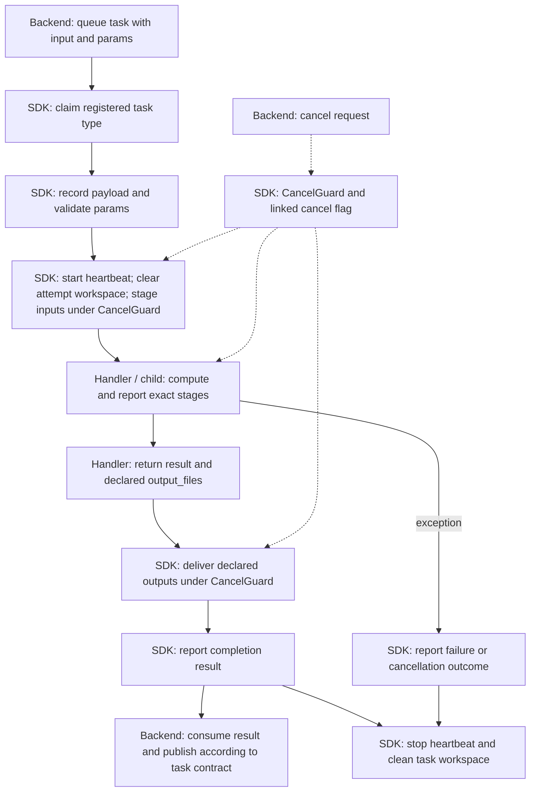
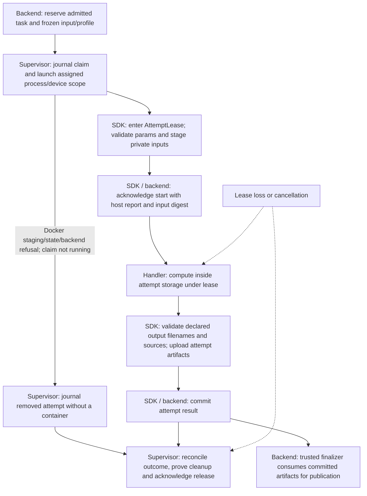

# Worker workflow documentation standard

This is the shared standard for workflow and pipeline guides in every worker
repository. Agents should read this contract, then the worker's linked guide
and source before proposing quality or performance changes. Fleet inventory
describes routing/configuration; workflow guides describe implemented behavior.
Neither proves what image is deployed or the progress of a live task.

## Required guide structure

Use one maintained guide per worker, with additional diagrams for distinct task
routes. Keep these concepts in this order; headings may reflect the workload.

1. **Scope and task contract:** source versus deployment status; wire task names,
   registered handler, activation gates, execution mode and input contract.
   Identify implemented adapters, unregistered paths and future work explicitly.
2. **Workflow diagrams:** one end-to-end view per distinct route, including
   worker computation and the result handoff. Show dependencies, branches and
   optional/cache paths that change quality, latency or outputs.
3. **Progress semantics:** exact emitted stage strings, producer, counter units
   and reporting channel. Explain unknown totals, repeated stages, percentages,
   ETA and gaps in reporting. Heartbeats are liveness, not measured work.
4. **Outputs and publication:** artifact names or logical keys, result fields,
   storage ownership and backend publication/finalizer boundary. Distinguish
   preview, final, intermediate and diagnostic files. Link the producer and
   consumer; mark a consumer outside the repo rather than guessing its behavior.
5. **Failure, cancellation and cleanup:** actual detection/checkpoints, child
   process/thread termination, stall/timeout rules, retry/cache reuse and who
   owns cleanup. Include failure paths in diagrams where they clarify the flow.
6. **Quality and latency checkpoints:** effective settings and their source,
   reproducible same-input comparisons, artifact/geometry/metric checks and
   timing boundaries. Separate implemented measurements from proposed checks.
7. **Implementation map:** relative links to registration, schema, handlers,
   computation, progress and output validation; external links for SDK/backend
   contracts. Identify the worker's installed SDK pin when protocol details vary.
8. **Maintenance:** update the guide with stage, gate, budget, output or lifecycle
   changes in the same PR; link it from README and agent context (`AGENTS.md`).

Avoid duplicating the SDK lifecycle implementation in every worker. Link the
reference below, then document worker-specific behavior and deviations. A
foundation or benchmark guide must say that it is not enrolled/deployed.

## Mermaid diagram rules

- Use fenced `mermaid` with `flowchart TD` for the main pipeline. Use descriptive
  node IDs, quoted labels, rectangles for steps/artifacts and diamonds for real
  decisions. Match the repository's plain language and actual wire stage names.
- Solid arrows mean ordered work or artifact handoff; label branch arrows with
  their condition. Dashed arrows mean cancellation/control signals, not data.
- Make ownership clear in boundary labels or subgraphs: **Backend**, **SDK /
  supervisor**, **Handler**, **Child / model**. Explain ownership in adjacent
  prose when several stages share one owner. Do not rely on color alone.
- Start with task inputs; finish with returned artifacts and an explicitly
  separate backend publication boundary. A child `done` or successful handler
  return does not establish case publication or supervised resource release.
- Draw only implemented routes. Put planned work in prose marked as planned.
  Keep runtime stage strings exact; label descriptive inner steps as inner work
  so readers do not mistake them for emitted progress.
- Prefer a small overview plus route diagrams over one unreadable graph. Keep
  source links in the implementation table so diagrams remain readable.

## SDK lifecycle reference

The following is the current SDK source map. Workers must verify their installed
SDK pin and mode before applying these details to a deployed process.

### Polling / hybrid Worker

Errors can also occur during validation, staging, transfer or terminal reporting;
the diagram compresses those error edges. Completion transport failures can be
ambiguous and must not be described as automatically safe to rerun. Some worker
handlers write durable shared outputs themselves; their guide must describe
that deviation from the declared-output transfer path.

`ProgressReporter.update(stage, current, total)` updates shared state and makes
an immediate one-shot report. A background heartbeat resends the latest state.
Counters default to 0/0 and are handler-defined; the SDK does not infer overall
percentage or ETA. Handler cancellation must reach its own computation boundary.

### Supervised admitted attempt

Committing artifacts, publishing case data and proving resource release are
distinct responsibilities. Do not substitute this route for polling, or imply
an adapter is deployed because `run_admitted` exists. Staging failures before
start acknowledgement are reconciled by the supervisor, not failed as started
compute. The SDK entrypoint imports the handler only after start acknowledgement.

Docker refusals for an expired staging deadline, a non-reserved attempt or an
unsupported GPU backend record a `removed` launch in the private host journal,
unless the claim is `running`. Existing launch rows are preserved. On the next
cycle, recovery cleans attempt scratch, signs cleanup evidence and releases the
reservation through the existing backend protocol. Fencing and configuration
errors do not create this recovery record. This describes SDK source behavior,
not deployed host status; the Windows adapter has its own phase machine.

| Shared responsibility | Source |
|---|---|
| Wire task names and statuses | [enums.py](../../src/task_worker_api/enums.py) |
| Typed task parameters | [schemas](../../src/task_worker_api/schemas) |
| Polling/hybrid and admitted execution | [worker.py](../../src/task_worker_api/worker.py), [admitted_worker.py](../../src/task_worker_api/admitted_worker.py) |
| Progress, heartbeat and cooperative cancellation | [progress.py](../../src/task_worker_api/progress.py), [cancel.py](../../src/task_worker_api/cancel.py) |
| Input staging and output delivery | [files.py](../../src/task_worker_api/files.py) |
| Attempt lease and supervisor cleanup/release | [resource_execution.py](../../src/task_worker_api/resource_execution.py), [admission_supervisor.py](../../src/task_worker_api/admission_supervisor.py) |
| Claim/outcome journal | [claim_journal.py](../../src/task_worker_api/claim_journal.py) |

## Review and improvement procedure

For each guide PR, verify relative source links, stage strings and counters,
handler registration/gates, output producers/consumers and cleanup ownership.
Review Mermaid branching and ownership; render it when graph complexity makes
the ordering unclear. Run repository checks required for the change. Do not
claim live task progress, deployment or measured quality from documentation.

For an improvement, identify the exact stage and contract being changed, fetch
the same original input, record effective settings/source/image/hardware, then
compare stage timing and final output quality. Link that evidence in the PR and
update the affected diagram or table. Keep worker algorithms in their own repos;
keep this shared format and SDK lifecycle reference here.

Apply the [worker improvement scopes and acceptance gates](improvement-scopes.md)
for visual fidelity, real-time Android rendering, generation measurements,
regression reproduction and Surgiclaw integration. Dependency reviews must
identify a relevant benefit and compare final outputs before adopting a change.
