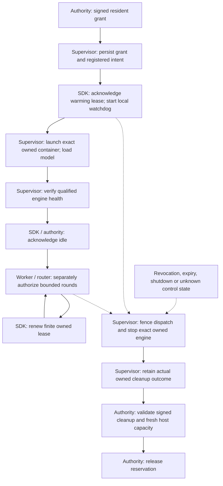

# Resident service grants

This SDK foundation adds a finite resident inference-resource lifecycle beside
task admission. It is source implementation, not an enrolled or deployed worker.
It does not invent a task/case, route model requests, import an engine, classify
prompt contents, or publish results. The authority must implement the matching
service endpoints and enforce primary priority in its existing reservation ledger.

## Contract and lifecycle

`ServiceProfile` shares validated CPU/RAM/GPU/scratch quantities with task
profiles and binds service/model revision/configuration, destination, public
synthetic scope, residence and reclaim limits. `SignedServiceGrant` binds the
profile and genuine hardware-attempt ownership to authority/host/boot/engine
epochs. `service_claim` verifies the dedicated authority signature and requested
enrollment. The authenticated `ServiceState` is control-plane state, not a signed
router readiness advertisement; that advertisement uses its separate scoped key.

All source state strings are `warming`, `idle`, `serving`, `revoked`, `expired`,
`releasing`, `released`. Heartbeats renew finite ownership; they are not progress
or measured work. Reclaim and inference-round outcomes are separate. This SDK
neither marks a lost round cancelled nor permits replay of unknown inference.

## API and persistence

Use `BackendClient` with its existing `/api/v1` base URL. Calls are POSTs to
`/services/claim` and `/services/{attempt_id}/ready|renew|status|release`.
Persist the claim request UUID before sending. Persist mutation UUIDs before
ready/renew/release; transport retries retain the same request body. The caller
provides `operation_id_factory('renew')` to the lease from its durable journal.
The authority remains the hardware ledger; SDK journals store owned launch and
operation history, not a second scheduler.

`ResidentServiceLease(client, grant, read_report, on_withdraw, stop_owned,
force_stop_owned, operation_id_factory=...)` requires async `read_report` and
trusted synchronous supervisor callbacks. Enter before launching. After actual
engine health, call `await lease.ready(operation_id, host_report)`. Loading uses
`require_live`; every dispatch uses `require_dispatch` or `can_dispatch`.
`lease_expires_at` is the latest acknowledged authority timestamp;
`remaining_seconds` subtracts latency with a monotonic clock. Router freshness
must also respect that remaining runway.

`withdraw()` and `close()` immediately fence SDK dispatch without needing the
event loop. Independent threads call stop and, if reclaim stalls/fails, the exact
owned force-stop callback. `wait_stopped()` waits no longer than the reclaim
budget and returns a trusted `CleanupEvidence` or None (unknown). Callback
completion, grant expiry and a closed socket never release the ledger.

## Cleanup and recovery

`DockerSupervisor.register_service(grant)` records fresh ownership before
configuration or loading. `launch_service(grant, lease, **launch_parameters)`
reuses the inspected image/network/device and CPU/RAM restrictions. Its private
journal excludes worker mounts and binds the exact profile and engine epoch.
`service_address` obtains only the inspected owned container's network IP.
`running_service`, `cleanup_service`, `force_stop_service` and
`sign_cleanup_service` reconcile that exact owned container; unknown inspection
or removal preserves quarantine. A retained registered prelaunch intent can
prove no launch; an absent/reset journal row cannot. Recovered idle/serving
grants cannot enter a new lease. Reconcile cleanup and release first, then obtain
new ownership; launch intents are never replayed to restart an old engine.

## Qualification and implementation map

Synthetic tests exercise signature purpose/scope, immutable epochs, response
latency/deadline limits, blocked-loop expiry, partition/revocation, persistent
renewal IDs, prelaunch proof, owned launch/removal and Docker task regressions.
Real platform reclaim duration, allocator release, aggregate fit and competing
primary launch paths require separate host qualification before enrollment.
GPU assignment is not a per-process VRAM limiter. Windows resident-service
launch is not implemented by this foundation.

Sources: [contracts](../src/task_worker_api/service_protocol.py),
[client](../src/task_worker_api/client.py),
[lease](../src/task_worker_api/service_execution.py),
[owned Docker adapter](../src/task_worker_api/docker_supervisor.py),
[shared budgets](../src/task_worker_api/resources.py),
[tests](../tests/test_services.py). Update this guide with lifecycle/API changes.
This foundation builds on accepted SDK source
`c38f1a2e60714af39d13ce9af48b987aed041cc1`; it is not a published SDK pin.
